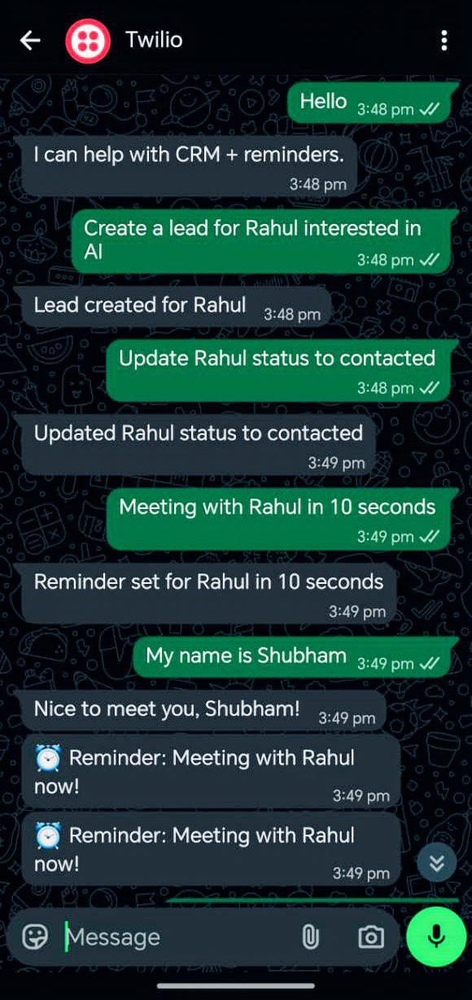
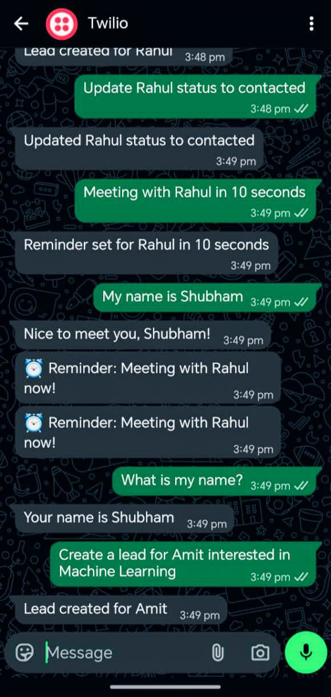

# 🚀 AI CRM Agent with WhatsApp Automation & Smart Reminders

<p align="center">
  <b>📱 Manage leads, automate follow-ups, and interact with AI — directly from WhatsApp</b><br>
  <i>Built using FastAPI • Twilio • APScheduler • SQLite</i>
</p>

<p align="center">
  
  
  
  
</p>

---

## ✨ Overview

**AI CRM Agent** is a real-time backend automation system that enables users to manage CRM workflows directly via **WhatsApp**.

It combines:

* 🤖 AI-style agent logic
* 🧠 Memory-aware conversations
* ⏰ Automated reminders
* 📲 WhatsApp integration

> ⚡ Designed as a **production-style backend system** demonstrating real-world API integration, async scheduling, and conversational automation.

---

## 📸 Live Demo (Real WhatsApp Interaction)

<p align="center">
  
  
</p>

---

## 💬 Example Interaction

```text
User: Create a lead for Rahul interested in AI
Bot: Lead created for Rahul

User: Update Rahul status to contacted
Bot: Updated Rahul status to contacted

User: Meeting with Rahul in 10 seconds
Bot: Reminder set for Rahul in 10 seconds

(After 10 seconds)
Bot: ⏰ Reminder: Meeting with Rahul now!

User: My name is Shubham
Bot: Nice to meet you, Shubham!

User: What is my name?
Bot: Your name is Shubham
```

---

## 🔥 Key Features

🚀 WhatsApp-based CRM automation\
🧠 Conversational memory (remembers user data)\
⏰ Real-time follow-up reminders\
⚙️ FastAPI backend with clean architecture\
📦 SQLite database for lead storage\
🔄 Background scheduler for automation

---

## 🏗️ System Architecture

```text
        WhatsApp User
              │
              ▼
        Twilio API (Webhook)
              │
              ▼
        FastAPI Backend
      (Agent + Business Logic)
              │
     ┌────────┴────────┐
     ▼                 ▼
SQLite Database     Memory Store
     │
     ▼
Scheduler (APScheduler)
     │
     ▼
WhatsApp Reminder 🚀
```

---

## 🛠️ Tech Stack

| Category       | Technology          |
| -------------- | ------------------- |
| Backend        | FastAPI (Python)    |
| Messaging      | Twilio WhatsApp API |
| Database       | SQLite              |
| Scheduler      | APScheduler         |
| Env Management | python-dotenv       |

---

## ⚙️ Setup Instructions

### 1️⃣ Clone the repository

```bash
git clone https://github.com/yourusername/ai-crm-agent.git
cd ai-crm-agent
```

---

### 2️⃣ Create virtual environment

```bash
python -m venv venv
venv\Scripts\activate   # Windows
```

---

### 3️⃣ Install dependencies

```bash
pip install -r requirements.txt
```

---

### 4️⃣ Configure environment variables

Create `.env` file:

```env
TWILIO_ACCOUNT_SID=your_account_sid
TWILIO_AUTH_TOKEN=your_auth_token
```

---

### 5️⃣ Run the server

```bash
uvicorn app.main:app --reload
```

---

### 6️⃣ Expose to internet (for WhatsApp)

```bash
ngrok http 8000
```

Set webhook in Twilio:

```text
https://your-ngrok-url/whatsapp
```

---

## ⏰ Reminder System

* Parses user commands like:
  👉 *“Meeting with Rahul in 10 seconds”*
* Stores follow-up time in DB
* Scheduler triggers background job
* Sends WhatsApp reminder automatically

---

## 💼 Real-World Use Cases

✔ Sales CRM automation\
✔ Customer follow-up systems\
✔ WhatsApp business assistants\
✔ AI-powered backend services

---

## 🚀 Future Enhancements

🔥 LLM integration (OpenAI / Gemini / Groq)\
🌐 Web dashboard (React / Next.js)\
☁️ Cloud deployment (Render / Railway)
📊 Analytics dashboard\
🎤 Voice-based interaction

---

## 👨‍💻 Author

**Shubham Swarnakar**
🎓 B.Tech CSE (AI & ML)\
🚀 Passionate about AI Systems, Backend Engineering & Automation

---

## ⭐ Show Your Support

If you found this project useful:

👉 Star ⭐ the repository\
👉 Share with others\
👉 Connect on LinkedIn\

---

## ⚡ Highlight

> Built a production-style AI-powered CRM automation system integrating WhatsApp, conversational memory, and real-time scheduling — showcasing strong backend engineering and system design skills.

---

<p align="center">
  🔥 <b>Not just a project — a real backend system</b> 🔥
</p>
